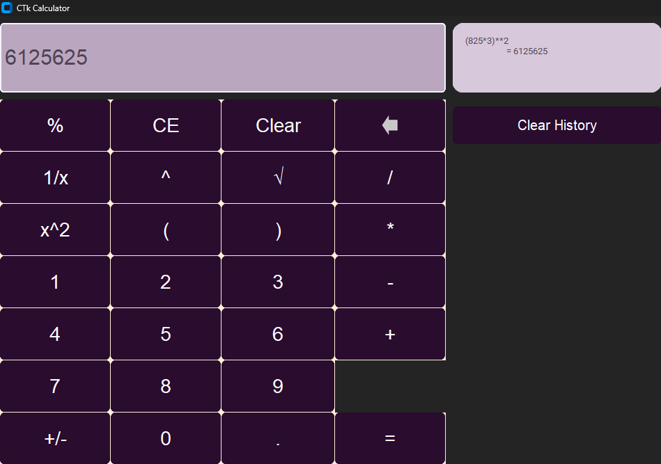

# 🧮 CustomTkinter Calculator


A modern, sleek calculator GUI built with **CustomTkinter** during my Python coursework. It features a clean dark theme inspired by ProtonVPN and includes useful extras like calculation history and special math functions.

  
*(Screenshot of the running application — dark purple/blue theme)*

## ✨ Features

- **Core Operations**: Addition, subtraction, multiplication, division, parentheses, and percentages
- **Advanced Functions**: Square (`x²`), Inverse (`1/x`), Square Root (`√`)
- **User-Friendly Extras**:
  - Live calculation history panel
  - Backspace button with custom icon
  - Clear Entry (CE) and full Clear
  - Error handling for invalid expressions
- Modern dark UI with custom colors (Proton-inspired purple/blue tones)

## 🛠️ Technologies Used

- **Python 3.12**
- **CustomTkinter** – for beautiful, modern widgets
- **Pillow (PIL)** – for icon handling
- **Tkinter** – base GUI framework

## 🚀 Getting Started

### Prerequisites
- Python 3.8+

### Installation

1. Clone the repository:
   ```Bash
   git clone https://github.com/81instincter/tkinter-calculator.git
   cd tkinter-calculator

2. Install the dependencies:
  ```Bash
  pip install -r requirements.txt

3. Run the application:
  ```Bash
  python customtkinter_calculator.py

